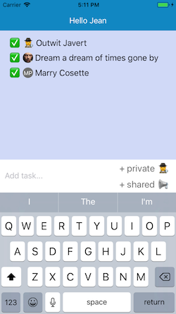

@doubledutch/rn-client
======================

DoubleDutch client library for building custom features with React Native

# Automated setup

The easiest way to get started is to install the [DoubleDutch command line tool](https://github.com/doubledutch/cli) and run `doubledutch init`.

See also [@doubledutch/firebase-connector](https://github.com/doubledutch/firebase-connector)
for an easy backend for your DoubleDutch feature.



# Usage

```jsx
import client, { TitleBar, Avatar } from '@doubledutch/rn-client'

console.log(client.currentUser)
console.log(client.currentEvent)
console.log(client.primaryColor)

client.getToken().then(token => console.log(`${token} is a valid DoubleDutch access token, usually used indirectly by other client libraries.`))

class HomeView extends ReactNative.Component {
  render() {
    <View>
      <TitleBar client={client} title={`Hello ${client.currentUser.FirstName}`} />
      <Avatar user={client.currentUser} size={40} />
    </View>
  }
}
```

# Documentation

## `client.currentUser`

Provides information about the current attendee.

```javascript
{
  UserId: '24601',                        // DoubleDutch user ID (required)
  ImageUrl: 'https://ddut.ch/image.jpg',  // Avatar image URL (optional)
  UserIdentifierId: 'jean@valjean.com',   // Unique ID provided by event organizer (required)
  FirstName: 'Jean',                      // Given name (required)
  LastName: 'Valjean',                    // Surname (required)
  Title: 'Character',                     // Job title (optional)
  Company: 'Les Misérables'               // Company attendee works for (optional)
}
```

## `client.currentEvent`

Provides information about the current event.

```javascript
{
  StartDate: '2017-01-01T00:00:00.000Z',  // First day of event
  EndDate: '2017-01-02T00:00:00.000Z',    // Last day of event
  EventId: 'sample-event-id',             // Event ID provided by DoubleDutch (required)
  Description: 'Happy New Year',          // Description of the event (optional)
  Name: 'New Year Kickoff',               // Name of the event (required)
  BundleId: 'sample-bundle-id'            // ID of the parent app that contains this event
}
```

## `client.primaryColor`

Primary color used in the event app, to match event branding.

```javascript
'#009acd'
```

## `client.getToken`

Returns a Promise which resolves to a valid access token.  Normally used
indirectly by other client libraries to access the DoubleDutch platform.

```javascript
client.getToken().then(token => /* Use the token. */)
```

## TitleBar

React Native component useful for interacting with the title bar that is native
to DoubleDutch apps.

In the simulator, a title bar will be rendered as React Native components. In a
native DoubleDutch iOS or Android app, the native app provides the title bar.
`<TitleBar />` abstracts away these differences to provide a simulated
experience that matches a real DoubleDutch app.

```jsx
<TitleBar client={client} title="Feature title" signin={this.signin} />
```

### Props

- `client`. The client imported from `@doubledutch/rn-client`. Required for
  setting the native `title` text in a DoubleDutch app.
- `title`. The desired text of the native title bar. Requires `client` prop to
  be set.
- `signin`. (Optional) Promise that will resolve when signin to a backend is
  complete.  If specified, the title bar will show connection status while 
  authenticating to your backend.  E.g. if using
  [@doubledutch/firebase-connector](https://github.com/doubledutch/firebase-connector),
  this can be the Promise returned by `fbc.signin()`.

## Avatar

React Native component that shows a circular avatar image of an attendee, or
his/her initials if no image is available.

```jsx
<Avatar user={user} size={25} />
```

### Props

- `user`. The attendee whose avatar should be displayed. This can be
  `client.currentUser` to display the avatar of the attendee currently viewing
  the app, or another attendee object.
- `size`. The diameter of the avatar image.